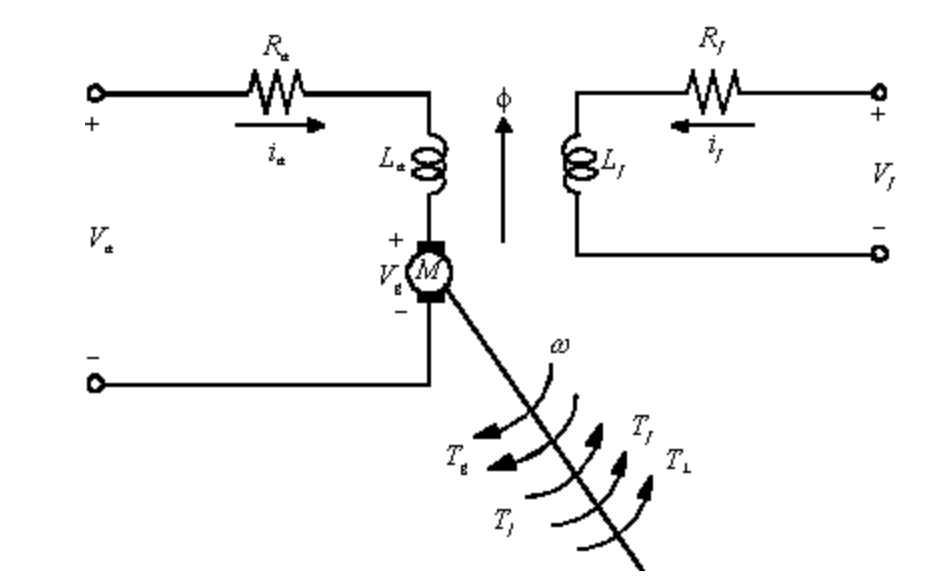
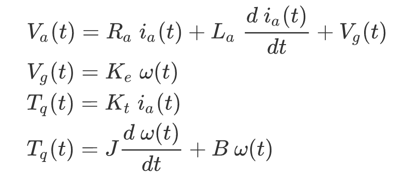
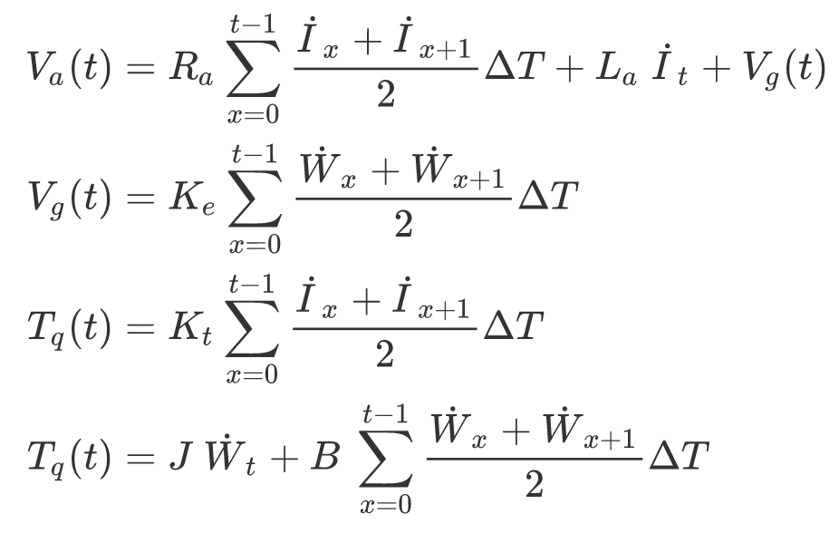
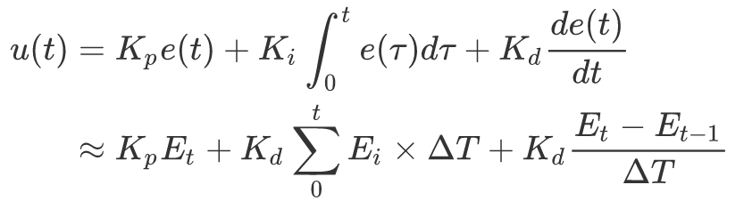

## Enviroment Setting
- build docker image
```
docker build . -t tensorflow-gpu
```

- activate docker container
```
./activate.sh
```

## ML
The machine learning model used in this project is LSMT. Training script `LSTM_training.ipynb` is modified from [nrlewis929/TCLab_emulate_PID](https://github.com/nrlewis929/TCLab_emulate_PID).

## Motor Simulator
`DC_Motor` is a dc motor simulator which is derived from the model below.







#### Reference

- [**直流馬達的模型化與參數判別**](http://pemclab.cn.nctu.edu.tw/peclub/W3cnotes/cn09/)

## Discrete PID Controller


